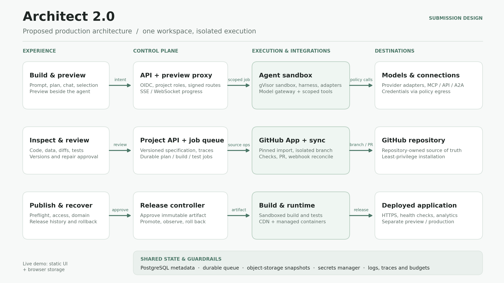

# Architect 2.0 — architecture decisions

This document distinguishes the **working submission prototype** from the **production architecture I would build**. The live prototype demonstrates the complete user journey and its state transitions. It runs as a static browser application, stores projects in `localStorage`, uses deterministic generation/answers, and exports a runnable Node project. OAuth, remote repository operations, agent-framework execution, and generated-app hosting are represented by explicit demo flows. The diagram and the choices below describe how I would replace those seams in production; they are not claims about services already running.

## Product boundary and source of truth

One project has a versioned specification: pages, design tokens, agents, connections, data schemas, access settings, environment-variable names, source revision, and deployment configuration. The workspace presents the same project at different levels of detail: chat and preview for intent, Agents/Data for behavior, and Code/Changes for implementation. An accepted change produces a traceable version; a release points to an immutable source artifact and configuration snapshot. Secret **values** are separate from the versioned specification.

I would keep a small control plane independent of the generated applications. The control plane owns identity, project metadata, permissions, jobs, version history, provider connections, and release records. User applications run in isolated execution environments and are reached only through a proxy. This separation makes an imported repository no more trusted than generated code.

## Component choices

| Concern | Production choice and reason |
|---|---|
| Workspace and authentication | React/Next.js with TypeScript for the workspace; OIDC sign-in through Auth.js or an enterprise identity provider. Server-side sessions carry organization, project, and role scope. The generated app's end-user authentication is configured separately from the builder account. |
| Control-plane API | TypeScript API with schema-validated commands and a durable event log. PostgreSQL holds organizations, projects, versions, job/release metadata, and authorization relationships. Object storage holds source archives, build logs, and immutable release manifests. |
| Jobs and progress | A durable queue such as Temporal (or Postgres-backed jobs for the first release) runs plan, build, test, import, and deploy steps. Each step emits structured progress, file changes, traces, and recoverable errors over SSE to the workspace. Idempotency keys prevent duplicate builds or deploys on retry. |
| Sandbox | Disposable per-project/per-branch Linux workspaces in gVisor-isolated containers, with CPU, memory, time, and disk quotas. Non-root execution, read-only base images, no host Docker socket, restricted syscalls, and allowlisted network egress reduce the impact of generated or imported code. Workspace snapshots live in object storage; idle sandboxes stop. |
| Agent harness | A framework-neutral job contract (`plan`, `edit`, `run`, `test`, `trace`, `cancel`) coordinates tools and checkpoints. Framework adapters package LangGraph, CrewAI, OpenAI Agents SDK, Lyzr-managed, or custom agents behind the same run/trace interface. Framework code executes only in the sandbox or a managed agent runtime, never in the control-plane process. |
| Model agnosticism | A model gateway normalizes message, tool-call, streaming, and usage events. Provider adapters support OpenAI, Anthropic, Google, and compatible endpoints. Workspace policy selects allowed providers/models, applies budgets, handles retries/fallbacks, and records cost and latency. Provider credentials are held in a secrets manager, scoped to a job, and never added to prompts or source archives. |
| Proxy and connections | An authenticated API/preview proxy routes browser requests and WebSockets to the correct sandbox or published app without exposing worker addresses. A separate egress proxy mediates MCP/OpenAPI/A2A calls with per-agent action scopes, timeouts, audit logs, and injected short-lived credentials. |
| GitHub integration | A GitHub App with repository-level installation and minimum required permissions. Installation webhooks are signature-checked; imports read a pinned commit into a sandbox. Architect writes to a branch, presents the diff and test result, then opens a PR. GitHub remains the source of truth for repository-owned projects; incoming webhook revisions trigger reconciliation instead of silent overwrites. |
| Deployment | Buildpacks or a declared Dockerfile produce an immutable image in the sandbox. A release controller promotes a tested artifact to a preview environment, then to production after explicit review. Static frontends can use a CDN; agent/API processes use a managed container runtime such as Kubernetes. The proxy provides HTTPS, custom-domain routing, health checks, access policy, and rollback to an earlier release manifest. |

## The two execution paths

**Prompt to app.** The user describes an outcome; the planner proposes pages, data, agent responsibilities, integrations, and an ownership choice. The user can revise the plan. The harness writes a versioned change set in a sandbox, runs build and tests, and streams an interactive preview. Selecting a visible answer carries component and agent identity into the next request. Accepting a change records the files and behavior affected. Publishing freezes an artifact, configuration, and test result into a release.

**Repository to app.** A GitHub App installation grants access to one selected repository. Import pins a commit and inspects framework, scripts, environment-variable **names**, agents, data, and deployment configuration inside a sandbox. The user reviews the findings before changing anything. Work occurs on a branch, with diffs and checks before a PR. A merged commit is deployed through the same release controller as a prompted project. Unsupported stacks receive a clear compatibility report and a local export path rather than a false claim of a successful import.

## Failure, security, and scale decisions

- A sandbox can be discarded and rebuilt from the pinned source/version. Jobs have timeouts, cancellation, retries for transient failures, and a visible trace. Failed tests block promotion and offer a reviewable repair; they do not auto-merge a fix.
- Secrets are named in versioned configuration but stored only in a secrets manager. The proxy injects scoped credentials at runtime, masks logs, and blocks arbitrary outbound calls by default. Project roles govern who may connect repositories, change secrets, approve tool access, and publish.
- Preview and production use separate origins, credentials, and data. Signed, expiring preview routes prevent one project's code from reading another's cookies or workspace state. Database changes require migration checks before promotion and a distinct recovery policy from code rollback.
- Stateless control-plane and proxy replicas scale horizontally. Job queues absorb bursty generation; autoscaling workers handle sandbox demand; published app runtimes scale separately from the builder. Per-organization concurrency/budget limits keep one build from starving other users.
- Trace IDs connect the prompt, tool approvals, model calls, source version, checks, PR, and release. Metrics cover build success/time, preview readiness, agent errors, provider latency/cost, and deployment health. An operator can diagnose a failed step without reading private user content by default.

## Delivery sequence

1. Replace browser-only project persistence with identity, PostgreSQL, object storage, and versioned APIs while retaining the current end-to-end workspace flow.
2. Add disposable sandbox execution, real tests/preview proxy, and the model gateway. Start with one generated stack and explicit compatibility checks.
3. Add the GitHub App, pinned imports, branch/PR reconciliation, and release controller.
4. Expand framework adapters, organization controls, external connections, and autoscaling from measured usage.

The submission's functioning pieces and demo boundaries are listed in [README.md](README.md) and mapped to the brief in [COVERAGE.md](COVERAGE.md). The current prototype is intentionally smaller than this production design so the reviewer can experience the complete UX without connecting accounts or installing infrastructure.
